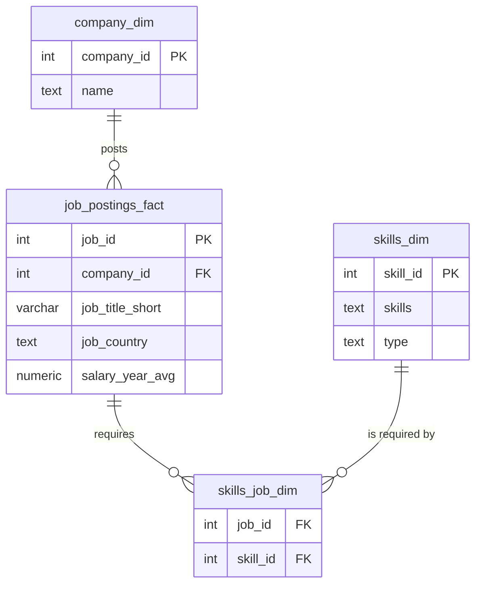
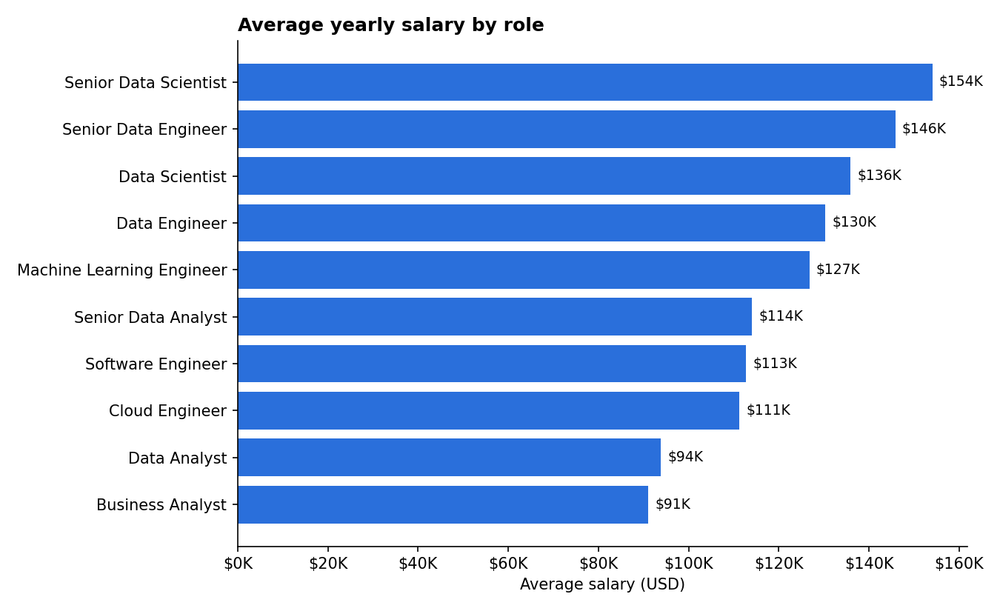
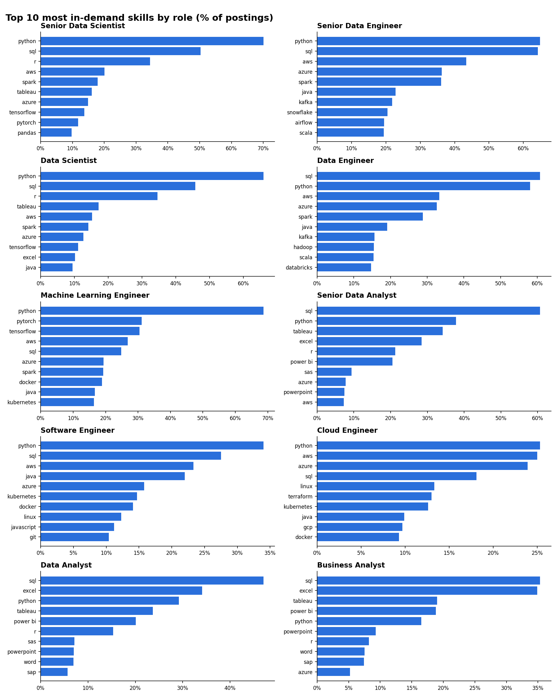
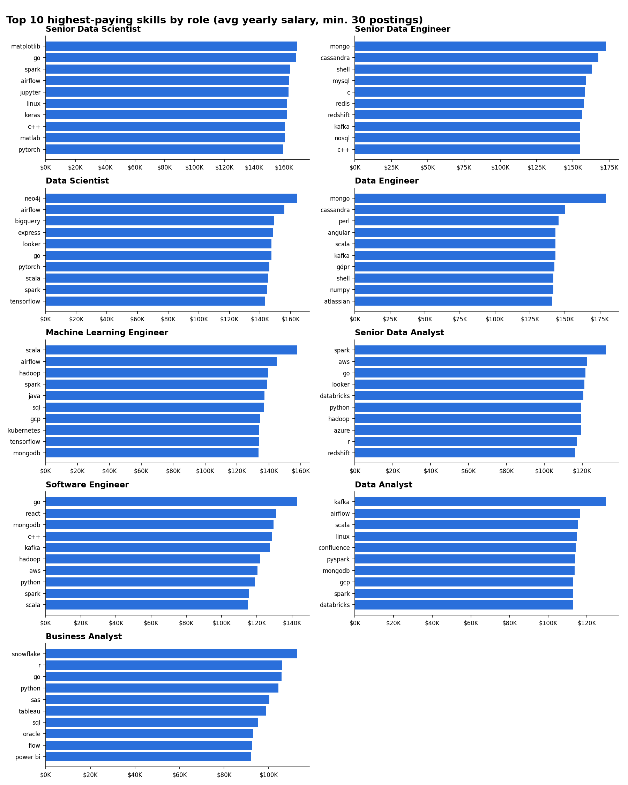

# What Pays in Data? A SQL Analysis of 787K Job Postings

An end-to-end **SQL** project exploring the 2023 data job market: what each role pays, which skills employers ask for, and which skills are worth the most money.

All analysis is written in SQL (PostgreSQL-compatible). A small Python script runs the queries with [DuckDB](https://duckdb.org/) and draws the charts, so anyone can reproduce the results without setting up a database server.

## Questions answered

1. What is the **average salary** for each data role?
2. Which **skills are most in demand** for each role?
3. Which **skills pay the most** for each role?
4. What are the **optimal skills** to learn (high demand *and* high pay)?

## Tools

- **SQL** (PostgreSQL dialect): CTEs, joins, window functions, aggregates
- **DuckDB**: in-process SQL engine used to run the queries on the CSVs
- **Python** (pandas, matplotlib): exports results and draws charts only
- **Git and GitHub**: version control

## Data model

A star schema with one fact table, two dimensions and a bridge table for the many-to-many relationship between postings and skills ([`sql/0_create_tables.sql`](sql/0_create_tables.sql)).



| Table | Rows |
|---|---:|
| `job_postings_fact` | 787,686 |
| `company_dim` | 140,033 |
| `skills_dim` | 259 |
| `skills_job_dim` | 3,669,604 |

---

## 1. Average salary by role

[`sql/1_avg_salary_by_role.sql`](sql/1_avg_salary_by_role.sql)

```sql
SELECT
    job_title_short                                   AS role,
    COUNT(*)                                          AS salaried_postings,
    ROUND(AVG(salary_year_avg), 0)                    AS avg_salary,
    ROUND(PERCENTILE_CONT(0.5)
          WITHIN GROUP (ORDER BY salary_year_avg), 0) AS median_salary
FROM job_postings_fact
WHERE salary_year_avg IS NOT NULL
GROUP BY job_title_short
ORDER BY avg_salary DESC;
```



| Role | Salaried postings | Avg salary | Median salary |
|---|---:|---:|---:|
| Senior Data Scientist | 1,686 | $154,050 | $155,000 |
| Senior Data Engineer | 1,594 | $145,867 | $147,500 |
| Data Scientist | 5,926 | $135,929 | $127,500 |
| Data Engineer | 4,509 | $130,267 | $125,000 |
| Machine Learning Engineer | 573 | $126,786 | $106,000 |
| Senior Data Analyst | 1,132 | $114,104 | $111,175 |
| Software Engineer | 469 | $112,778 | $99,150 |
| Cloud Engineer | 65 | $111,268 | $90,000 |
| Data Analyst | 5,463 | $93,876 | $90,000 |
| Business Analyst | 617 | $91,071 | $85,000 |

**Insights**
- Data science and data engineering roles pay **$35K–$45K more** than analyst roles.
- Moving to a **senior** title adds about **$15K–$20K** in every track.
- For ML, Software and Cloud Engineers the mean sits well above the median, so a few very high salaries pull the average up.

---

## 2. Most in-demand skills by role

[`sql/2_top_skills_by_role.sql`](sql/2_top_skills_by_role.sql) uses CTEs, a three-table join, and `ROW_NUMBER() OVER (PARTITION BY ...)` to keep the top 10 skills per role.

```sql
ranked AS (
    SELECT
        sc.job_title_short AS role,
        sc.skill,
        ROUND(100.0 * sc.postings_with_skill / rt.total_postings, 1) AS pct_of_postings,
        ROW_NUMBER() OVER (
            PARTITION BY sc.job_title_short
            ORDER BY sc.postings_with_skill DESC
        ) AS demand_rank
    FROM skill_counts AS sc
    INNER JOIN role_totals AS rt ON sc.job_title_short = rt.job_title_short
)
SELECT * FROM ranked WHERE demand_rank <= 10;
```



| Role | #1 skill | #2 skill | #3 skill |
|---|---|---|---|
| Data Analyst | SQL (47%) | Excel (34%) | Python (29%) |
| Senior Data Analyst | SQL (61%) | Python (38%) | Tableau (34%) |
| Business Analyst | SQL (35%) | Excel (35%) | Tableau (19%) |
| Data Engineer | SQL (61%) | Python (58%) | AWS (33%) |
| Senior Data Engineer | Python (65%) | SQL (64%) | AWS (43%) |
| Data Scientist | Python (66%) | SQL (46%) | R (35%) |
| Senior Data Scientist | Python (70%) | SQL (50%) | R (34%) |
| Machine Learning Engineer | Python (69%) | PyTorch (31%) | TensorFlow (31%) |
| Software Engineer | Python (34%) | SQL (28%) | AWS (23%) |
| Cloud Engineer | Python (25%) | AWS (25%) | Azure (24%) |

**Insights**
- **SQL is the #1 skill** for every analyst and data engineering role, and in the top 2 for all data science roles.
- Analysts are expected to know BI tools (Excel, Tableau, Power BI). Engineers need cloud (AWS, Azure) and big-data tools (Spark, Kafka).

Full results: [`results/2_top_skills_by_role.csv`](results/2_top_skills_by_role.csv)

---

## 3. Highest-paying skills by role

[`sql/3_top_paying_skills_by_role.sql`](sql/3_top_paying_skills_by_role.sql) uses `HAVING COUNT(*) >= 30` so that niche skills averaged over only a few postings don't skew the ranking, then `RANK()` within each role.

```sql
WITH skill_salaries AS (
    SELECT jp.job_title_short AS role, s.skills AS skill,
           COUNT(*) AS salaried_postings,
           ROUND(AVG(jp.salary_year_avg), 0) AS avg_salary
    FROM job_postings_fact AS jp
    INNER JOIN skills_job_dim AS sj ON jp.job_id = sj.job_id
    INNER JOIN skills_dim     AS s  ON sj.skill_id = s.skill_id
    WHERE jp.salary_year_avg IS NOT NULL
    GROUP BY jp.job_title_short, s.skills
    HAVING COUNT(*) >= 30
)
SELECT *, RANK() OVER (PARTITION BY role ORDER BY avg_salary DESC) AS pay_rank
FROM skill_salaries;
```



| Role | Top-paying skill | Avg salary |
|---|---|---:|
| Senior Data Scientist | matplotlib | $168,607 |
| Senior Data Engineer | mongo | $172,808 |
| Data Scientist | neo4j | $163,971 |
| Data Engineer | mongo | $179,403 |
| Machine Learning Engineer | scala | $157,451 |
| Senior Data Analyst | spark | $132,649 |
| Software Engineer | go | $142,748 |
| Data Analyst | kafka | $129,999 |
| Business Analyst | snowflake | $112,543 |

**Insights**
- The best-paying skills are mostly **engineering and big-data tools** (Kafka, Spark, Scala, Airflow, NoSQL databases).
- A **Data Analyst** who knows Kafka, Airflow or Spark earns **$19K–$36K above** the average analyst salary.
- Cloud Engineer is excluded here: only 65 of its postings list a salary, so no skill reaches the 30-posting minimum.

Full results: [`results/3_top_paying_skills_by_role.csv`](results/3_top_paying_skills_by_role.csv)

---

## 4. Optimal skills to learn (demand × pay)

[`sql/4_optimal_skills.sql`](sql/4_optimal_skills.sql) combines four CTEs (role baseline, demand, pay, scoring). It keeps skills that appear in at least **10% of a role's postings** and ranks them by salary, showing each skill's **premium over the role's average salary**.

| Role | Best skills to learn (salary premium vs. role average) |
|---|---|
| Data Analyst | Python (+$7.6K), R (+$4.8K), Tableau (+$4.1K), SQL (+$2.6K) |
| Senior Data Analyst | Python (+$5.3K), R (+$3.2K), SQL (+$0.9K) |
| Business Analyst | Python (+$13.2K), Tableau (+$7.7K), SQL (+$4.2K) |
| Data Engineer | Scala (+$12.9K), Kafka (+$12.8K), Snowflake (+$7.2K), Java (+$7.0K) |
| Senior Data Engineer | Redshift (+$10.7K), Kafka (+$9.1K), NoSQL (+$8.8K) |
| Data Scientist | Spark (+$8.5K), TensorFlow (+$7.5K), AWS (+$2.9K) |
| Senior Data Scientist | Spark (+$10.0K), PyTorch (+$5.6K), TensorFlow (+$2.2K) |
| Machine Learning Engineer | Spark (+$12.1K), Java (+$10.4K), SQL (+$10.1K) |
| Software Engineer | AWS (+$7.7K), Python (+$6.0K), JavaScript (+$1.7K) |

**Insights**
- For analysts, **SQL is expected and Python sets you apart**: it is the common skill with the biggest pay premium.
- Excel and Power BI are heavily requested but pay **below** the analyst average.
- Across engineering and science roles, **Spark and Kafka** stand out for both demand and pay.

Full results: [`results/4_optimal_skills.csv`](results/4_optimal_skills.csv)

---

## SQL techniques demonstrated

| Technique | Where |
|---|---|
| Schema design: primary keys, foreign keys, bridge table, indexes | `0_create_tables.sql` |
| Bulk loading with `COPY` | `0_create_tables.sql` |
| Aggregates and `PERCENTILE_CONT ... WITHIN GROUP` (median) | `1_avg_salary_by_role.sql` |
| Multi-table `INNER JOIN`s across fact, bridge and dimension tables | `2`, `3`, `4` |
| Common Table Expressions (CTEs), chained | `2`, `3`, `4` |
| Window functions: `ROW_NUMBER()`, `RANK()` with `PARTITION BY` | `2`, `3`, `4` |
| `GROUP BY ... HAVING` to keep only skills with enough postings | `3`, `4` |
| `CASE` expressions and comparing each row to its group baseline | `4_optimal_skills.sql` |

## How to reproduce

```bash
git clone https://github.com/shahrozz1/sql-data-jobs-salary-skills-analysis.git
cd sql-data-jobs-salary-skills-analysis
python3 -m venv .venv && source .venv/bin/activate
pip install -r requirements.txt
# put the 4 CSVs in data/ (see data/README.md)
python run_analysis.py
```

The script loads the CSVs with `sql/0_create_tables.sql`, runs queries 1–4, and writes the outputs to `results/` and `charts/`. The SQL files also run as-is in PostgreSQL (use `\copy` in psql for local files).

## Caveats

- Salary figures come only from postings that list a yearly salary (about 22K of 787K postings).
- Salaries are not adjusted for country or cost of living.
- "Average salary for a skill" shows correlation, not causation: skills often appear together in senior, better-paid jobs.
